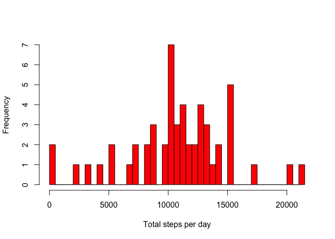
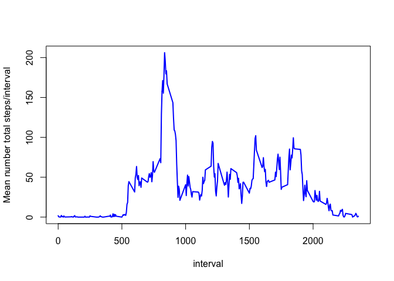
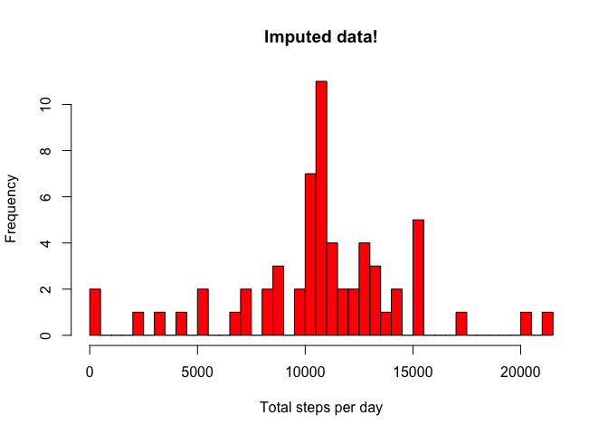
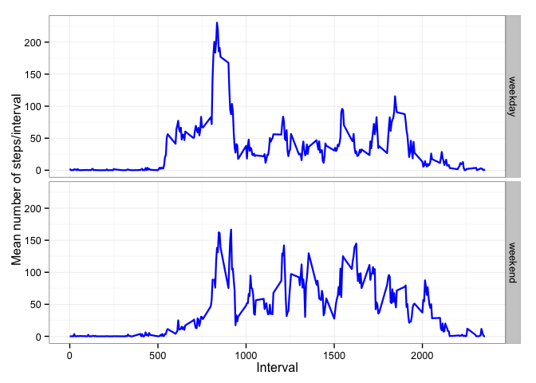

# Reproducible Research: Peer Assessment 1


This project makes use of [RStudio's projects][Rproj] ("*.Rproj").
The folder, in which the .Rproj-file is located in,
is automatically set as the **working directory** by RStudio
when opening the .Rproj-file.
Thus there is no need to explicitly set the working directory.

Clear the workspace.

```r
rm(list = ls())
```

Load the packages used in this project (and install them if they are not yet installed).
The custom `load.packages` function takes a character vector of R-packages names.


```r
# Define the `load.packages` function
load.packages <- function(packages) {
    for (package in packages) {
        if (!package %in% installed.packages())
            install.packages(package)
        library(package, character.only = TRUE)
    }
}

# Load the packages
load.packages(c("dplyr",
                "ggplot2", 
                "readr", 
                "knitr"))
```

```
## 
## Attaching package: 'dplyr'
## 
## The following objects are masked from 'package:stats':
## 
##     filter, lag
## 
## The following objects are masked from 'package:base':
## 
##     intersect, setdiff, setequal, union
```


## Loading and preprocessing the data

Read the CSV-file using `read_delim` from the `readr`package.


```r
dat <- read_delim(file = "activity.zip", 
                  delim = ",",
                  col_types = list(col_integer(),
                                   col_datetime(),
                                   col_integer()))
```

There are **17,568 observations** 
in this data set, which is **the 
same**
as the 17,568 observations mentioned in the instructions.

The data types of the three variables are:


```r
glimpse(dat)
```

```
## Observations: 17568
## Variables:
## $ steps    (int) NA, NA, NA, NA, NA, NA, NA, NA, NA, NA, NA, NA, NA, N...
## $ date     (time) 2012-10-01, 2012-10-01, 2012-10-01, 2012-10-01, 2012...
## $ interval (int) 0, 5, 10, 15, 20, 25, 30, 35, 40, 45, 50, 55, 100, 10...
```

These are the six and last six observations, respectively.


```r
head(dat)
```

```
## Source: local data frame [6 x 3]
## 
##   steps       date interval
## 1    NA 2012-10-01        0
## 2    NA 2012-10-01        5
## 3    NA 2012-10-01       10
## 4    NA 2012-10-01       15
## 5    NA 2012-10-01       20
## 6    NA 2012-10-01       25
```

```r
tail(dat)
```

```
## Source: local data frame [6 x 3]
## 
##   steps       date interval
## 1    NA 2012-11-30     2330
## 2    NA 2012-11-30     2335
## 3    NA 2012-11-30     2340
## 4    NA 2012-11-30     2345
## 5    NA 2012-11-30     2350
## 6    NA 2012-11-30     2355
```

Here are summary statistics for the three variables.


```r
lapply(dat, summary)
```

```
## $steps
##    Min. 1st Qu.  Median    Mean 3rd Qu.    Max.    NA's 
##    0.00    0.00    0.00   37.38   12.00  806.00    2304 
## 
## $date
##         Min.      1st Qu.       Median         Mean      3rd Qu. 
## "2012-10-01" "2012-10-16" "2012-10-31" "2012-10-31" "2012-11-15" 
##         Max. 
## "2012-11-30" 
## 
## $interval
##    Min. 1st Qu.  Median    Mean 3rd Qu.    Max. 
##     0.0   588.8  1178.0  1178.0  1766.0  2355.0
```


## What is mean total number of steps taken per day?


### Calculate the total number of steps taken per day

I'm using the `dplyr` package.


```r
per_day <- summarize(group_by(dat, date),
                     steps_total = sum(steps, na.rm = FALSE),
                     NAs_prop = mean(is.na(steps)))
```

The stem-and-leaf display below shows that all days have 0% missing values in 
the steps-variable, except for 8 days where 
100% of the observations are missing.
In other words, for some reason no data was collected on those 
8 days, but on the other 
53 days, the data is complete.


```r
stem(per_day$NAs_prop)
```

```
## 
##   The decimal point is 1 digit(s) to the left of the |
## 
##    0 | 00000000000000000000000000000000000000000000000000000
##    2 | 
##    4 | 
##    6 | 
##    8 | 
##   10 | 00000000
```

Therefore I decided to set `na.rm = FALSE` when summing up the steps per day.
If one were to set `na.rm = TRUE` then on they days were no data is available,
one would get zero steps for that day, which does not make sense 
(i.e., we just did not observe any steps for these days, 
we cannot ascertain that the person walked zero steps on these days).


### Make a histogram of the total number of steps taken each day


```r
hist(
    per_day$steps_total, 
    breaks = 50, 
    col = "red",
    xlab = "Total steps per day",
    main = "")
```

 


### Calculate and report the mean and median of the total number of steps taken per day


```r
total_mean <- format(
    mean(per_day$steps_total, na.rm = TRUE), 
    digits = 0, 
    big.mark = ",", 
    scientific = FALSE
    )

total_median <- format(
    median(per_day$steps_total, na.rm = TRUE), 
    digits = 0, 
    big.mark = ",", 
    scientific = FALSE
    )
```


As the data summary below shows:

- the **mean** is 10,766, and
- the **median** is 10,765.


```r
summary(per_day$steps_total, digits = 5)
```

```
##    Min. 1st Qu.  Median    Mean 3rd Qu.    Max.    NA's 
##      41    8841   10765   10766   13294   21194       8
```


## What is the average daily activity pattern?

Calculate the average (i.e., mean) number of steps for each interval.


```r
per_interval <- summarize(
    group_by(dat, interval),
    avg_steps = mean(steps, na.rm = TRUE)
)
```


### Make a time series plot


```r
with(per_interval, {
    plot(interval, avg_steps, 
         type = "l", 
         col = "blue", 
         lwd = 2, 
         ylab = "Mean number total steps/interval")    
})
```

 


### 5-minute interval with maximum number of steps

Find the interval with the maximum number of steps.


```r
interval_max_steps <- with(per_interval, {
    interval[which.max(avg_steps)]
})

max_steps <- max(per_interval$avg_steps) %>%
    format(digits = 0)
```

The interval **835** has maximum number of steps 
(= 206) among all intervals.

Plot the time series again including the maximum point (in red).


```r
with(per_interval, {
    plot(interval, avg_steps, 
         type = "l", 
         col = "blue", 
         lwd = 2,
         ylab = "Mean number total steps/interval")    
})

points(
    x = interval_max_steps, 
    y = max_steps, 
    col = "red", 
    cex = 1.5, 
    pch = 19)

abline(v = interval_max_steps, col = "red")
```

 


## Imputing missing values

### Calculate and report the total number of missing values in the dataset

Calculate the number of rows with at least one NA in any of the three columns.


```r
NAs_rowd_na <- sum(apply(is.na(dat), 1, sum) > 0)
```

Threre are **2,304** rows with missing values 
(out of 17,568 total number of rows; 
or 13%).


### Strategy for filling in all of the missing values

For any missing observation of steps, I will impute the **mean** value observed
for the corresponding interval on all other days. 


### Create new dataset with the missing data filled in.


Copy original dataset.


```r
dat_imp <- dat
```

Find row numbers of rows with missing values in "steps".


```r
dat_NA_indices <- which(is.na(dat_imp$steps))
```

Loop through those rows and insert imputed values.


```r
for (i in dat_NA_indices) {
    
    # interval of current case i
    interval_i <- dat_imp[i, "interval"] %>% unlist
    
    # replacement value for current case i 
    impute_value_i <- per_interval[which(
        per_interval$interval == interval_i),
        "avg_steps"] %>% unlist
    
    # insert replacement value for current case i 
    dat_imp[i,"steps"] <- impute_value_i
}
```


### Histogram of the total number of steps taken each day (imputed data)


```r
per_day_imp <- summarize(group_by(dat_imp, date),
                     steps_total = sum(steps))
hist(
    per_day_imp$steps_total, 
    breaks = 50, 
    col = "red",
    xlab = "Total steps per day",
    main = "Imputed data!")
```

 


### Calculate and report the mean and median total number of steps taken per day (imputed data)


```r
total_mean_imp <- format(
    mean(per_day_imp$steps_total, na.rm = TRUE), 
    digits = 0, 
    big.mark = ",", 
    scientific = FALSE
    )

total_median_imp <- format(
    median(per_day_imp$steps_total, na.rm = TRUE), 
    digits = 0, 
    big.mark = ",", 
    scientific = FALSE
    )
```

As the data summary below shows, for the **imputed data**:

- the **mean** is 10,766 (vs. before: 10,766), and
- the **median** is 10,766  (vs. before: 10,765).


```r
summary(per_day_imp$steps_total, digits = 5)
```

```
##    Min. 1st Qu.  Median    Mean 3rd Qu.    Max. 
##      41    9819   10766   10766   12811   21194
```

The mean and median number of total steps per day is roughly the **same** 
when using the imputed data, where missing values were replaced with 
the mean value observed for the same interval.


## Are there differences in activity patterns between weekdays and weekends?

Classify each observation as pertaining to a weekend or a weekday. 


```r
weekend <- weekdays(dat_imp$date, abbreviate = FALSE) %in% 
    c("Saturday", "Sunday")

dat_imp$day_type <- NA
dat_imp$day_type[weekend == TRUE] <- "weekend"
dat_imp$day_type[weekend == FALSE] <- "weekday"
```


Compare the daily activity between weekdays and weekends.


```r
per_interval_day_type_imp <- summarize(
    group_by(dat_imp, day_type, interval),
    avg_steps = mean(steps, na.rm = TRUE)
)


ggplot(per_interval_day_type_imp, 
       aes(interval, avg_steps)) +
    theme_bw() +
    geom_line(color = "blue", size = .8) +
    xlab("Interval") + 
    ylab("Mean number of steps/interval") +
    facet_grid(day_type ~ .) 
```

 

It seems that the person got active somewhat later in the day on weekends.


[Rproj]: https://support.rstudio.com/hc/en-us/articles/200526207-Using-Projects
